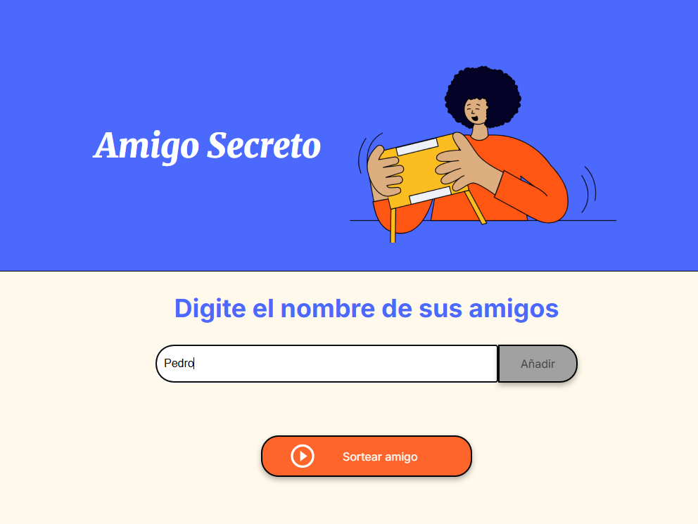
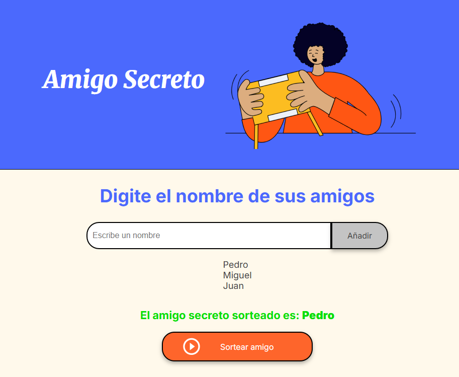

# 🤫 Amigo Secreto


Un sencillo pero divertido programa para realizar el sorteo del "Amigo Secreto" entre un grupo de amigos. Este proyecto fue desarrollado como parte del Challenge de Lógica de Programación de Alura Latam.

## ✨ Funcionalidades Principales

-   **Añadir participantes:** Ingresa el nombre de un amigo y añádelo a la lista de participantes.
-   **Sorteo aleatorio:** Realiza un sorteo justo y aleatorio para emparejar a los amigos, asegurando que nadie se sortee a sí mismo.
-   **Visualización de resultados:** Muestra claramente los emparejamientos del sorteo.
-   **Diseño Responsivo:** Se adapta a diferentes tamaños de pantalla, como móviles y computadoras de escritorio.

## 🚀 Demostración

Aquí puedes ver cómo funciona la aplicación.

### 1. Agregando Amigos a la Lista

En el campo de texto, escribe el nombre de cada participante y haz clic en "Añadir" o presiona la tecla "Enter". Los nombres aparecerán en la lista de "Amigos incluidos".



### 2. Realizando el Sorteo

Una vez que todos los participantes han sido añadidos, haz clic en el botón "Sortear amigo".


### 3. Viendo los Resultados

¡Listo! La aplicación mostrará la lista de parejas del amigo secreto.



## 🛠️ Tecnologías Utilizadas

-   **HTML5:** Para la estructura semántica de la página.
-   **CSS3:** Para los estilos, el diseño visual y la responsividad.
-   **JavaScript:** Para toda la lógica de la aplicación (añadir amigos, sortear, mostrar resultados).

## 💻 Cómo Usar

1.  Clona este repositorio en tu máquina local:
    ```bash
    git clone git@github.com:Alvarez-Hans/alura-challenge-amigo-secreto.git
    ```
2.  Navega a la carpeta del proyecto.
3.  Abre el archivo `index.html` en tu navegador web preferido.
4.  ¡Y listo! Ya puedes empezar a usar la aplicación.

## 👨‍💻 Autor

**Hans Alvarez**

-   📧 Correo: alvarez.hans@gmail.com
-   👔 LinkedIn: https://www.linkedin.com/in/hans-alvarez-fuentes/
-   🐙 GitHub: https://github.com/Alvarez-Hans

---

¡Gracias por revisar mi proyecto! ✨